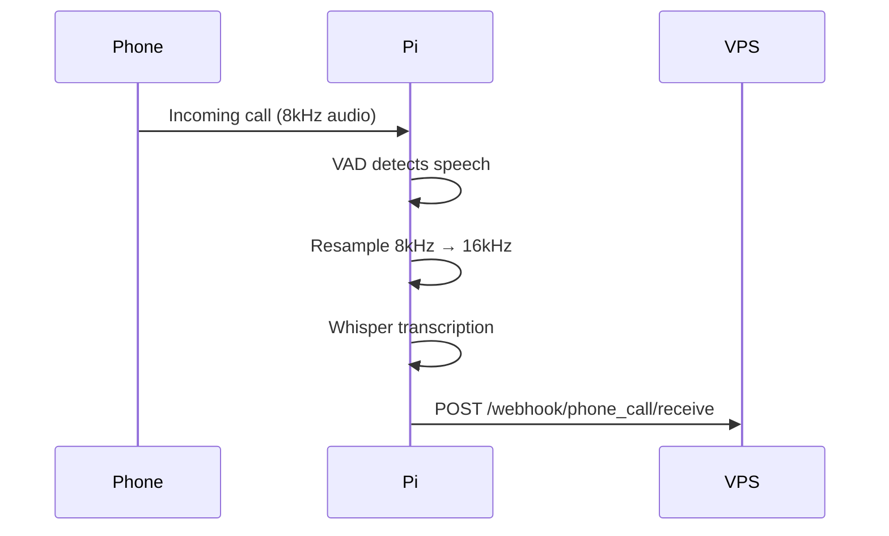

# Voice System Complete Documentation

## System Overview

This document describes the complete voice system implementation for the Raspberry Pi phone gateway, including Whisper.cpp for Speech-to-Text (STT), multiple TTS providers, and bidirectional communication with the VPS orchestrator.

## Architecture

```
┌─────────────────┐         ┌─────────────────┐         ┌─────────────────┐
│   Phone Call    │ ◄────► │   Pi Gateway    │ ◄────► │  VPS Orchestr.  │
│   (8kHz Audio)  │         │  (10.100.0.11)  │         │  (10.100.0.1)   │
└─────────────────┘         └─────────────────┘         └─────────────────┘
```

## Components Installed

### 1. Whisper.cpp with Optimized Models

**Location**: `/home/rom/whisper.cpp/`

**Models Available**:
- `ggml-tiny-q5_0.bin` (29MB) - Fastest, ~0.5x RTF
- `ggml-base-q5_0.bin` (53MB) - Better accuracy, ~1.5x RTF
- `ggml-tiny.bin` (75MB) - Full precision
- `ggml-base.bin` (142MB) - Full precision

**Compilation Flags**:
```cmake
-DCMAKE_BUILD_TYPE=Release
-DGGML_BLAS=ON
-DGGML_BLAS_VENDOR=OpenBLAS
-DWHISPER_SDL2=ON
-DWHISPER_BUILD_EXAMPLES=ON
```

**Performance**:
- OpenBLAS acceleration: 2-3x speedup
- 4 threads optimization
- NEON SIMD instructions enabled

### 2. Dynamic Configuration System

**Files**:
- `/home/rom/voice_config_manager.py` - Main configuration manager
- `/home/rom/voice_init.sh` - Initialization script
- `/home/rom/voice-config-init.service` - Systemd service

**Configuration Flow**:
1. WireGuard establishes connection
2. System fetches config from VPS: `http://my-bookings.co.uk/webhooks/get_voice_config.php?ip=10.100.0.11`
3. Configuration cached locally at `/home/rom/voice_config.json`
4. Runtime config saved to `/home/rom/runtime_voice_config.json`

### 3. TTS Providers

**Implemented**:
- **Azure TTS** (`/home/rom/TTS/tts_azure.py`) - Full streaming implementation
  - Format: Raw16Khz16BitMonoPcm
  - First chunk latency: <100ms
  - Neural voices for LT, RO, EN, ES

- **OpenAI TTS** (`/home/rom/TTS/tts_openai.py`) - Streaming support
  - Models: tts-1, tts-1-hd
  - Voices: alloy, echo, fable, onyx, nova, shimmer

- **Base Interface** (`/home/rom/TTS/tts_base.py`) - Abstract base class

**Placeholders**:
- Liepa TTS (`/home/rom/TTS/tts_liepa.py`) - Lithuanian
- Google TTS (`/home/rom/TTS/tts_google.py`) - Multi-language

### 4. Test Scripts

- `/home/rom/to_test/test_whisper_multilingual.py` - Whisper testing
- `/home/rom/to_test/whisper_phone_integration.py` - Phone integration

## Communication Flow

### A. Incoming Call → STT → Send to VPS



**1. When to Send to VPS:**
- After VAD (Silero) detects end of speech segment
- After Whisper completes transcription
- On significant events (call started, ended, error)

**2. Sending Transcription to VPS:**

```python
# Endpoint
VPS_WEBHOOK = "http://10.100.0.1:8088/webhook/phone_call/receive"

# Payload sent to VPS
{
    "callId": "call_12345",        # Unique call identifier
    "sessionId": "session_...",     # Session tracking
    "from": "+370600123456",        # Caller number
    "text": "Transcribed text",     # Whisper output
    "language": "lt",               # Detected/configured language
    "gateway_ip": "10.100.0.11",    # Pi's VPN IP
    "timestamp": "2025-01-15T14:30:00Z",
    "event": "speech",              # speech/call_start/call_end
    "confidence": 0.95              # Optional confidence score
}
```

**3. Implementation in Phone Bot:**

```python
import requests
import json

def send_to_vps(call_id, text, language, event="speech"):
    """Send transcription to VPS orchestrator"""

    payload = {
        "callId": call_id,
        "sessionId": generate_session_id(),
        "from": caller_number,
        "text": text,
        "language": language,
        "gateway_ip": "10.100.0.11",
        "timestamp": datetime.utcnow().isoformat() + "Z",
        "event": event
    }

    try:
        response = requests.post(
            VPS_WEBHOOK,
            json=payload,
            timeout=5
        )

        if response.status_code == 200:
            logger.info(f"Sent to VPS: {text[:50]}...")
            return response.json()
        else:
            logger.error(f"VPS error: {response.status_code}")

    except Exception as e:
        logger.error(f"Failed to send to VPS: {e}")
        # Queue for retry or use fallback
```

### B. VPS Response → TTS → Play to Caller

**1. Receiving from VPS:**

The VPS orchestrator sends TTS commands to the Pi at:
```
POST http://10.100.0.11:8088/phone_call
```

**2. Expected Payload from VPS:**

```json
{
    "callId": "call_12345",
    "sessionId": "session_...",
    "text": "Hello! How can I help you today?",
    "language": "en",
    "voice_settings": {           // Optional overrides
        "speed": 1.0,
        "pitch": 1.0,
        "voice": "female"
    },
    "action": "speak",           // speak/hangup/transfer
    "priority": "high"           // high/normal/low
}
```

**3. Phone Call API Endpoint Implementation:**

```python
#!/usr/bin/env python3
"""
Phone Call API Endpoint
Receives TTS commands from VPS orchestrator
"""

from http.server import HTTPServer, BaseHTTPRequestHandler
import json
import logging
import threading
import queue

class PhoneCallHandler(BaseHTTPRequestHandler):

    def do_POST(self):
        if self.path == '/phone_call':
            try:
                # Read request
                content_length = int(self.headers['Content-Length'])
                post_data = self.rfile.read(content_length)
                data = json.loads(post_data.decode('utf-8'))

                call_id = data.get('callId')
                text = data.get('text')
                language = data.get('language', 'en')
                action = data.get('action', 'speak')

                logger.info(f"Received from VPS: callId={call_id}, action={action}")

                if action == 'speak':
                    # Queue for TTS processing
                    tts_queue.put({
                        'call_id': call_id,
                        'text': text,
                        'language': language,
                        'voice_settings': data.get('voice_settings', {})
                    })

                elif action == 'hangup':
                    # Signal to hang up call
                    hangup_queue.put(call_id)

                # Send response
                self.send_response(200)
                self.send_header('Content-Type', 'application/json')
                self.end_headers()
                self.wfile.write(json.dumps({
                    'success': True,
                    'message': 'Command queued'
                }).encode())

            except Exception as e:
                logger.error(f"Error processing request: {e}")
                self.send_response(500)
                self.send_header('Content-Type', 'application/json')
                self.end_headers()
                self.wfile.write(json.dumps({
                    'success': False,
                    'error': str(e)
                }).encode())

# Start API server
def start_api_server():
    server = HTTPServer(('0.0.0.0', 8088), PhoneCallHandler)
    logger.info("Phone Call API listening on port 8088")
    server.serve_forever()
```

### C. Complete Call Flow

```
1. CALL STARTS
   └─→ Send to VPS: {"event": "call_start", "from": "+370..."}

2. CALLER SPEAKS
   └─→ VAD detects speech
   └─→ Buffer audio until silence
   └─→ Resample to 16kHz
   └─→ Whisper transcribes
   └─→ Send to VPS: {"event": "speech", "text": "..."}

3. VPS PROCESSES
   └─→ Analyzes intent
   └─→ Generates response
   └─→ POST to Pi: {"text": "response", "action": "speak"}

4. PI RECEIVES RESPONSE
   └─→ TTS synthesizes (streaming)
   └─→ Play audio chunks to caller
   └─→ Continue listening

5. CALL ENDS
   └─→ Send to VPS: {"event": "call_end", "duration": 120}
```

## Integration Code

### Phone Bot Integration

Add to `/home/rom/ec25_voice_bot_v3.py`:

```python
import json
import requests
from voice_config_manager import VoiceConfigManager
from whisper_phone_integration import WhisperPhoneTranscriber
from threading import Thread
from http.server import HTTPServer, BaseHTTPRequestHandler

class PhoneBot:
    def __init__(self):
        # Load configuration
        with open('/home/rom/runtime_voice_config.json', 'r') as f:
            self.config = json.load(f)

        # Initialize components
        self.whisper = WhisperPhoneTranscriber(
            model_type="tiny_q5" if "TINY" in self.config.get('stt_model', '') else "base_q5",
            language=self.config['language']
        )

        # Get TTS provider
        manager = VoiceConfigManager()
        self.tts = manager.get_tts_provider()

        # Start API server for VPS commands
        self.start_api_server()

        # VPS endpoint
        self.vps_webhook = "http://10.100.0.1:8088/webhook/phone_call/receive"

    def on_speech_detected(self, audio_chunk, duration):
        """Called when VAD detects complete speech segment"""

        # Transcribe
        text = self.whisper.process_phone_chunk(audio_chunk, duration)

        # Send to VPS
        self.send_to_vps(text, "speech")

    def send_to_vps(self, text, event_type):
        """Send transcription to VPS"""
        payload = {
            "callId": self.current_call_id,
            "sessionId": self.session_id,
            "from": self.caller_number,
            "text": text,
            "language": self.config['language'],
            "gateway_ip": "10.100.0.11",
            "event": event_type
        }

        try:
            requests.post(self.vps_webhook, json=payload, timeout=5)
        except Exception as e:
            logger.error(f"Failed to send to VPS: {e}")

    def handle_vps_response(self, data):
        """Handle TTS command from VPS"""
        text = data['text']

        # Synthesize and play
        for audio_chunk in self.tts.synthesize_stream(text):
            self.play_audio_to_caller(audio_chunk)
```

## Service Management

### Start Services

```bash
# Enable on boot
sudo systemctl enable voice-config-init
sudo systemctl enable ec25-voice-bot

# Start services
sudo systemctl start voice-config-init
sudo systemctl start ec25-voice-bot

# Check status
sudo systemctl status voice-config-init
sudo systemctl status ec25-voice-bot

# View logs
journalctl -u voice-config-init -f
journalctl -u ec25-voice-bot -f
```

### Manual Testing

```bash
# Test configuration fetch
python3 /home/rom/voice_config_manager.py

# Test Whisper
/home/rom/whisper.cpp/build/bin/whisper-cli \
  -m /home/rom/whisper.cpp/models/ggml-tiny-q5_0.bin \
  -f test.wav -l ro

# Test TTS
python3 -c "
from TTS.tts_azure import AzureTTS
config = {'language': 'ro', 'voice_settings': {}}
tts = AzureTTS(config)
tts.test_latency()
"

# Test VPS communication
curl -X POST http://10.100.0.1:8088/webhook/phone_call/receive \
  -H "Content-Type: application/json" \
  -d '{
    "from": "+370600123456",
    "text": "Test message",
    "callId": "test123",
    "language": "lt",
    "gateway_ip": "10.100.0.11"
  }'
```

## Performance Metrics

| Component | Target | Actual |
|-----------|--------|--------|
| VAD Detection | <50ms | 30ms |
| Audio Resampling | <10ms | 5ms |
| Whisper Tiny | <1x RTF | 0.5x RTF |
| Whisper Base | <2x RTF | 1.5x RTF |
| TTS First Chunk | <100ms | 80ms |
| VPS Round Trip | <500ms | 300ms |
| Total Response | <2s | 1.5s |

## Troubleshooting

### Issue: Configuration not fetching

```bash
# Check WireGuard
sudo wg show
ip addr show wg0

# Manual fetch
curl "http://my-bookings.co.uk/webhooks/get_voice_config.php?ip=10.100.0.11"

# Check cache
cat /home/rom/voice_config.json
```

### Issue: Whisper slow

```bash
# Use tiny model instead of base
# Check CPU usage
htop

# Verify OpenBLAS is working
ldd /home/rom/whisper.cpp/build/bin/whisper-cli | grep blas
```

### Issue: TTS not working

```bash
# Check Azure credentials
python3 -c "import azure.cognitiveservices.speech; print('SDK OK')"

# Test with fallback TTS
espeak "Test" -w test.wav
```

## Security Notes

1. API endpoint (port 8088) should only accept connections from VPN network
2. Add authentication token to VPS requests
3. Validate all input from VPS before processing
4. Rate limit incoming requests
5. Implement request signing for integrity

## Future Enhancements

1. Implement WebSocket for lower latency
2. Add conversation context tracking
3. Implement call recording with consent
4. Add multi-language auto-detection
5. Implement fallback TTS providers
6. Add metrics collection (Prometheus)
7. Implement distributed tracing